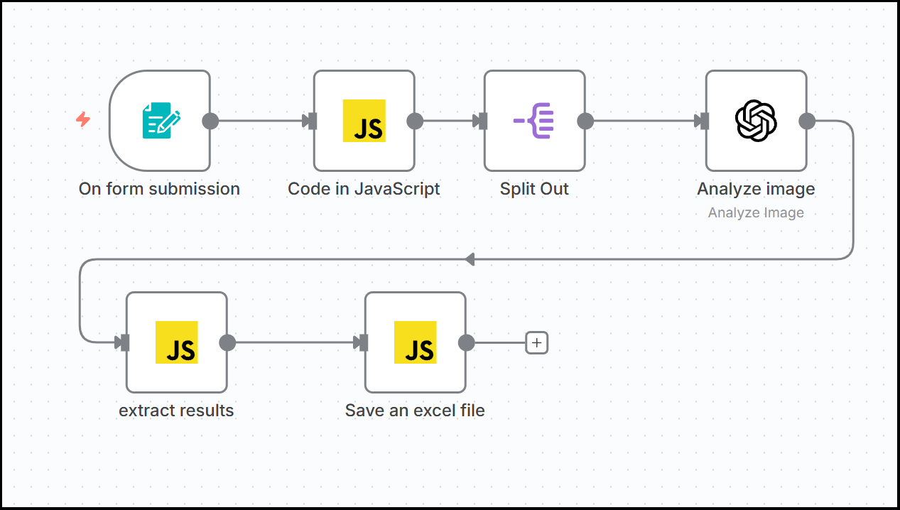
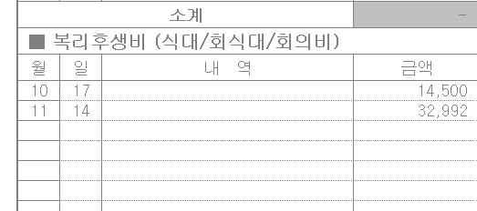

# An n8n workflow recoginizing the date and the amount on any receipt and writing them on an excel file automatically. 

영수증에 있는 날짜와  결제 금액을 OpenAI가 인식해서 excel로 되어 있는 비용청구서의 특정 위치에 출력하는 n8n workflow입니다. 인식은 OpenAI가 실행하고 excel 파일의 업데이트는 javascript 프로그램으로 이루어집니다. 이는 smart expense management의 일부입니다.  입력은 영수증을 찍은 그림 파일들이고 출력은 excel 파일입니다.  



시작은 <form> tag가 있는 "On form submission" 노드입니다.  다수의 그림 파일을 올릴 수 있는데 예를 들어 아래 파이썬 프로그램을 실행으로 진행시킬 수 있습니다.  

```
import requests

url = "http://localhost:5678/form-test/a86fa23c-100c-46b8-8349-27213c85d495"


files = [
        ('field', ("20251103_091817.jpg", open("20251103_091817.jpg", 'rb'), 'image/jpg')),
        ('field', ("20251118_074712.png", open("20251118_074712.png", 'rb'), 'image/png'))
]

response = requests.post(url, files=files)

print("status code:", response.status_code)
print("response text:", response.text)
```

OpenAI에게 그림 파일을 넘길 수 있도록 javascript와 Split Out 노드를 거칩니다.   "extract results" 노드가 입력으로 받은 json 데이터 중에서 "text: " field 다음에 나오는 날짜와 금액만 다음 노드인 "Save an excel file" 노드에 넘깁니다. 엑셀 결과가 아래에 있습니다. 



### n8n environments
```
n8n : 1.118.2
nodejs : v22.21.0
OS: ubuntu 24.04.02
```
